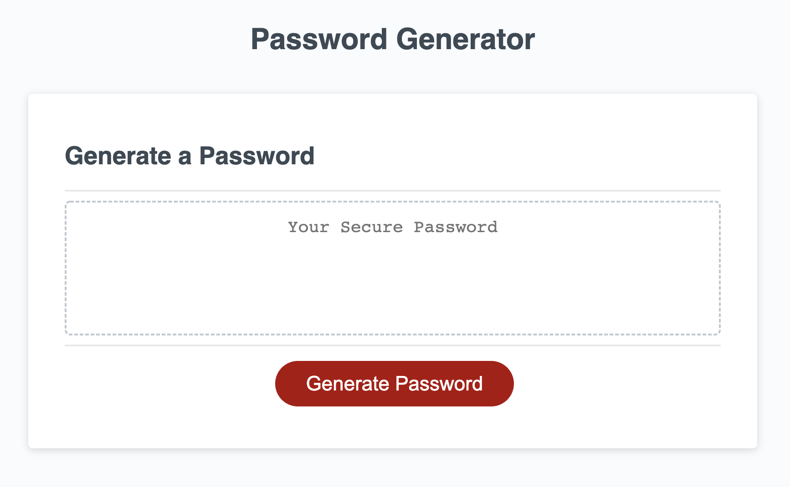
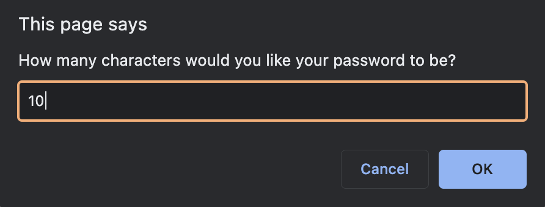
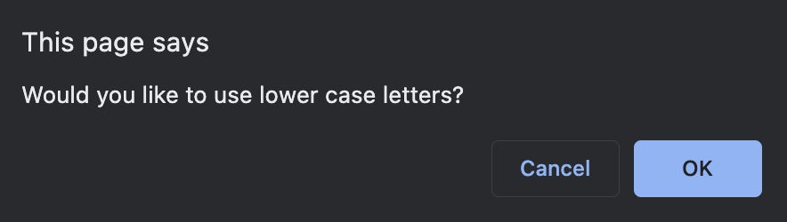
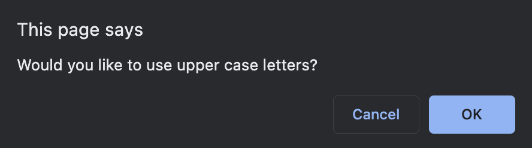
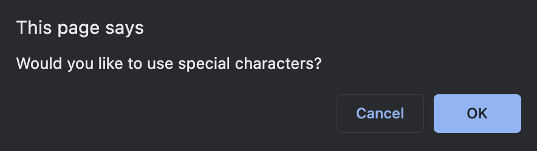
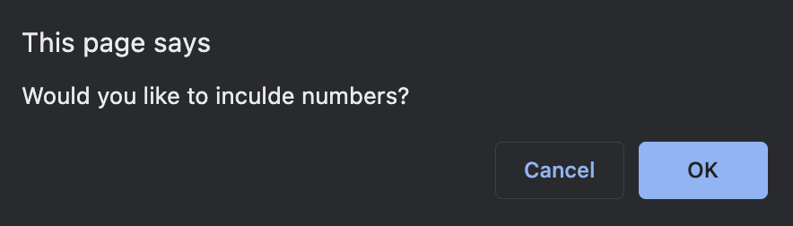
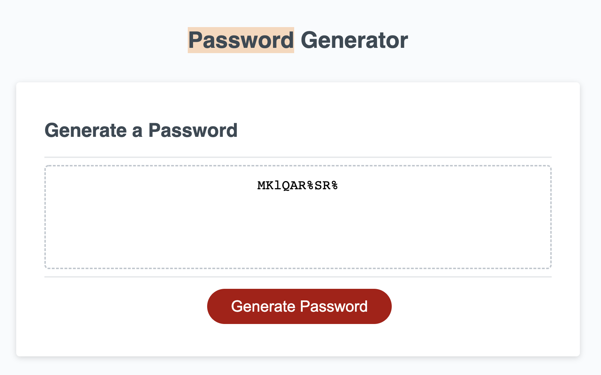

# Password Generator

## Description

This tool will allow you to generate a new password. The user will be prompted whether they would like the new password to include lowercase letters, uppercase letters, numbers and symbols. After all user choices have been made the generator will display a new password based on those choices. 

## Link to deployed application

https://sammymayhem.github.io/password-generator/

## Screenshots

Landing page:

First prompt:

Second prompt:

Third prompt:

Fourth prompt:

Fifth prompt:

Password generated:
